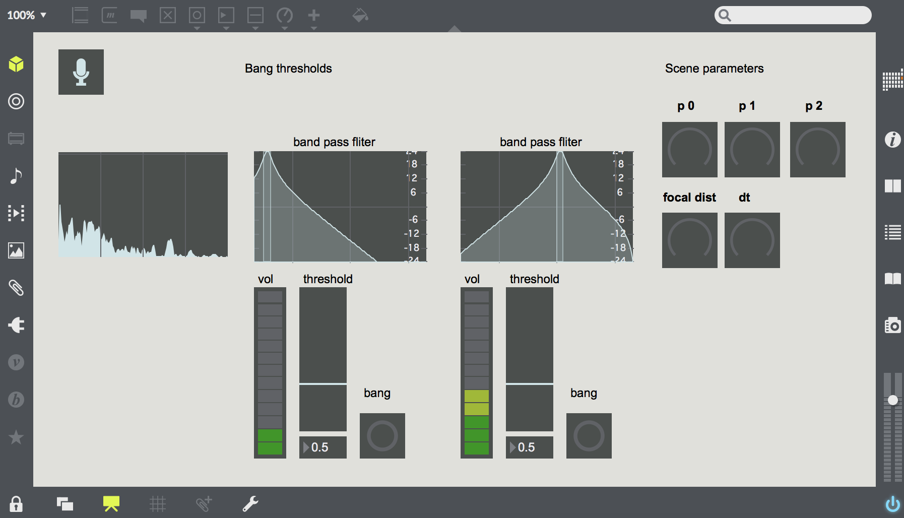

# SolidSubstanceVJ
A VJ set using motifs like mass solid substances. It is made by Max and openFrameworks. The Max part is to process sound input and send OSC to oF app. An oF part is generating CG on reaction with OSC.

## oF CG outputs

See also captured movies below.
* https://twitter.com/ayumu_naga/status/886150613125349377
* https://twitter.com/ayumu_naga/status/886243096240955392
### CG objects:
I reused objects I've made recently in [Daily Sketch repository](https://github.com/nama-gatsuo/DailySketch/) with minor modifications.
* [Calatrava Struct](https://github.com/nama-gatsuo/DailySketch/tree/master/CalatravaStruct)
* [Cycloid Instancing](https://github.com/nama-gatsuo/DailySketch/tree/master/CycloidInstancing)
* [Fractal Instancing](https://github.com/nama-gatsuo/DailySketch/tree/master/FractalInstancing)
* [Matrixed Instancing](https://github.com/nama-gatsuo/DailySketch/tree/master/MatrixedInstancing)
* [Random Joint](https://github.com/nama-gatsuo/DailySketch/tree/master/RandomJoint)
* [Tri Pattern](https://github.com/nama-gatsuo/DailySketch/tree/master/TriPat)
* [Tri Wall](https://github.com/nama-gatsuo/DailySketch/tree/master/TriWall)
### VFX:
* Two styles of rendering, wireframe with additve blending and solid drawing with photo-realistic shading.
* Core 3D vfx like shading, lighting, HDR bloom, defocus blur are from [ofxDeferredShading](https://github.com/nama-gatsuo/ofxDeferredShading)
* Also it has post rendering process effects. Two kind, the one is "warp" (vertical/horizontal mirror, complex plane transformation), and another is "black & white" (negative/positive grey scale).

## Max Controller

### Attack detection:
this Max app can detect attacks of sounds in frequency which user specifies with band pass filter(s) from audio input. And then it sends OSC to another app with a specified port.
### Parameter sender:
Sends values as OSC to simple address. A user can also use a MIDI controller device.

# Author
[Ayumu Nagamatsu](http://ayumu-nagamatsu.com)

# License
[MIT License](./LICENSE.md)
